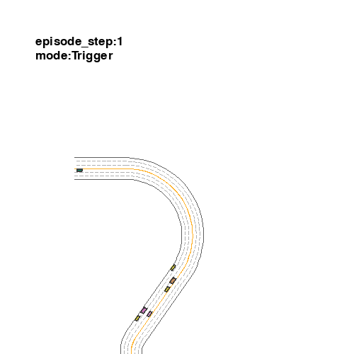
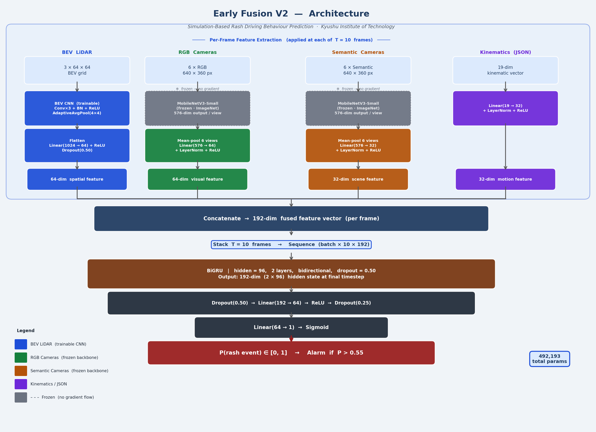
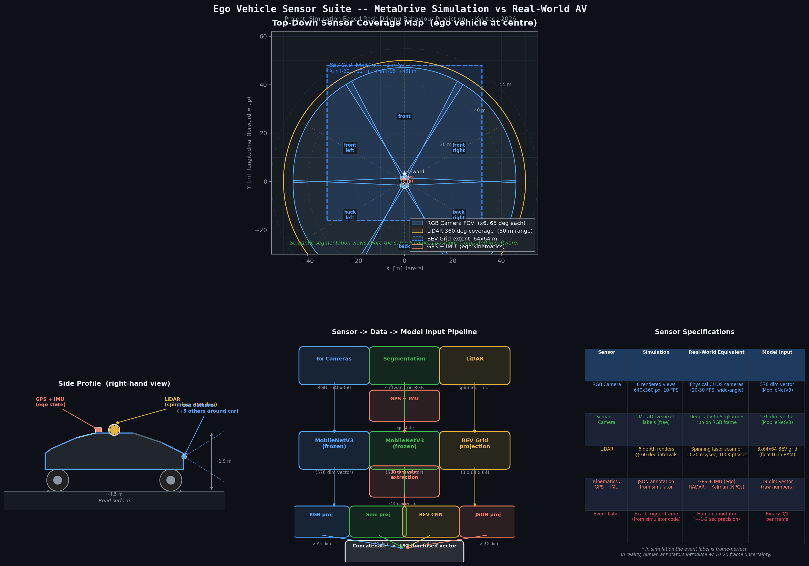

# Rash Driving Behaviour Prediction for Autonomous Vehicles

Multi-modal sensor fusion model that classifies nearby vehicles as rash drivers
in real time, using simulation-generated data from MetaDrive.



---

## Novelty

| Claim | Detail |
|-------|--------|
| **Task** | Predicts rash behaviour in *nearby* vehicles (third-party), not the ego driver |
| **Dataset** | Frame-accurate binary labels + 4 simultaneous modalities -- no public equivalent |
| **Model** | BEV CNN + surround RGB + surround semantic + kinematics --> BiGRU binary classifier |

---

## Results (Early Fusion v2, Test Set)

| Metric | Value |
|--------|-------|
| F1 Score | 0.9003 |
| Precision | 0.9368 |
| Recall | 0.8665 |
| AUROC | 0.8976 |
| Dangerous misses (FN + TTC < 3 s) | 0.8% |

---

## Architecture



**Four input streams:**
- **BEV LiDAR** -- 64x64x3 bird's-eye-view grid (height / intensity / density)
- **Surround RGB** -- MobileNetV3 features from 6 camera views (576-dim)
- **Surround Semantic** -- MobileNetV3 features from 6 semantic views (576-dim)
- **Kinematics** -- ego speed/heading + per-NPC position/speed/heading (19-dim)

All streams projected to 48-dim and concatenated --> 192-dim --> BiGRU --> binary output.

---

## Sensor Setup



---

## Dataset

Generated with MetaDrive 0.4.3 (CPU-only, pip-installable).

| Stat | Value |
|------|-------|
| Total frames | 17,559 |
| Event frames | 14,727 (rash) |
| Normal frames | 2,832 |
| Episodes | 43 |
| Test episodes | {9, 10, 47, 49} |
| Val episodes | {3, 6, 45, 46} |

Dataset is not included in this repository (too large).
Run `collect_dataset.py` to regenerate it.

---

## Quickstart

```bash
pip install -r requirements.txt
```

### Step 1 -- Collect dataset
```bash
python collect_dataset.py
```

### Step 2 -- Extract features and train Early Fusion v2
```bash
python train_early_fusion_v2.py
```
Phase 1 extracts MobileNetV3 features + BEV grids into `feature_cache_v2/` (~527 MB).
Phase 2 trains the BiGRU fusion model. Best checkpoint saved to `models/ef2_best.pt`.

### Step 3 -- Evaluate
```bash
# Standard metrics (F1, Precision, Recall, AUROC, ROC curve)
python eval_ef2.py

# TTC-calibrated safety evaluation
python eval_ttc.py
```

### Step 4 -- Explore the dataset interactively
```bash
jupyter notebook dataset_exploration.ipynb
```
Or regenerate the notebook from scratch:
```bash
python build_notebook.py
```

---

## File Structure

```
.
|-- collect_dataset.py          MetaDrive simulation + NPC scripting + annotation writer
|-- train_kinematic_lstm.py     Baseline: kinematics-only BiGRU (val F1 = 0.9275)
|-- train_early_fusion.py       Early Fusion v1: RGB + kinematics + LiDAR (val F1 = 0.9265)
|-- train_early_fusion_v2.py    Early Fusion v2: all 4 modalities (val F1 = 0.9455) [BEST]
|-- train_npc_early_fusion.py   Alternative: NPC-centric fusion variant
|-- eval_ef2.py                 Test set evaluation with ROC curve
|-- eval_ttc.py                 TTC-calibrated safety evaluation
|-- infer_kinematic_lstm.py     Single-frame inference for the kinematic baseline
|-- draw_architecture.py        Generates models/architecture_ef2.png
|-- draw_pipeline.py            Generates models/pipeline_ef2.png
|-- draw_sensor_diagram.py      Generates models/sensor_setup_diagram.png
|-- build_notebook.py           Generates dataset_exploration.ipynb via nbformat
|-- generate_docs_html.py       Converts .md docs to print-ready HTML
|-- dataset_exploration.ipynb   Interactive dataset explorer (34 cells)
|-- Thesis_Abstract.pdf         2 Page abstract, summarizing the dissertation
|-- Thesis.pdf                  Research Dissertation, credited with help of Kyutech Professors.
|-- requirements.txt
|
+-- models/
    |-- ef2_best.pt                 Best EF-v2 checkpoint (epoch 2, val F1 = 0.9455)
    |-- early_fusion_best.pt        EF-v1 checkpoint
    |-- kinematic_gru_best.pt       Kinematic baseline checkpoint
    |-- ef2_training_log.json       Per-epoch training metrics
    |-- architecture_ef2.png
    |-- pipeline_ef2.png
    |-- sensor_setup_diagram.png
    |-- ef2_training_curves.png
    |-- ef2_roc_curve.png
    |-- ef2_confusion_matrix.png
    |-- nb_*.png                    Pre-rendered notebook visualisations
```

---

## Environment

Developed and tested on:
- Python 3.8
- PyTorch 2.4.1 (CPU)
- MetaDrive 0.4.3
- Windows 11 / Linux compatible

No GPU required. Training completes on CPU in approximately 40 epochs (~30 min).

---

## Why MetaDrive over CARLA

| Factor | MetaDrive | CARLA |
|--------|-----------|-------|
| Installation | `pip install metadrive-simulator` | 10 GB Unreal Engine binary |
| GPU requirement | None (CPU-only) | >= 8 GB VRAM |
| Road layouts | Procedurally unlimited | 12 fixed maps |
| NPC scripting | Python-native, frame-exact | TCP client, sync jitter |
| Event label accuracy | Exact frame counter | Approximate |

---

## Citation / Attribution

If this work is useful for your research, please cite:

```
Simulation-Based Rash Driving Behaviour Prediction for Autonomous Vehicles
Using Multi-Modal Sensor Fusion
Master's Thesis, Kyushu Institute of Technology, 2026
```
